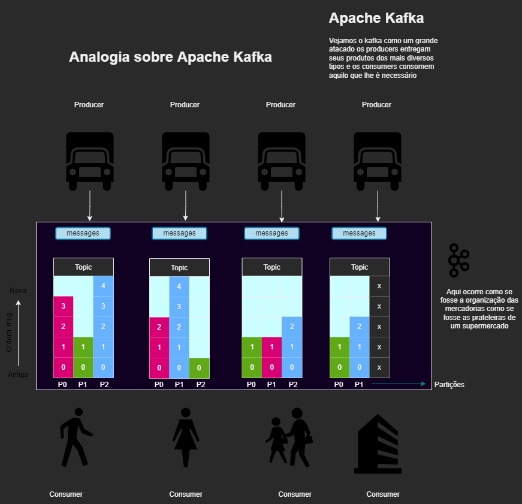
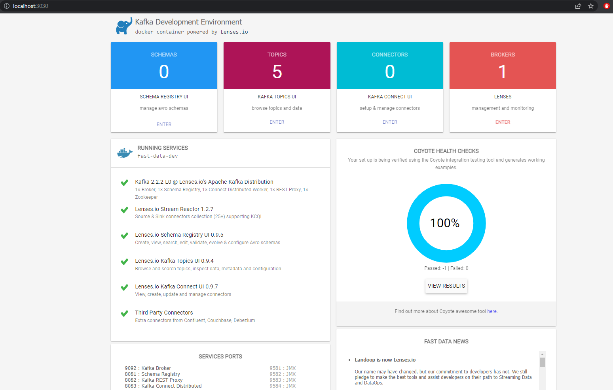
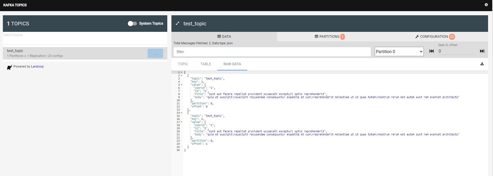
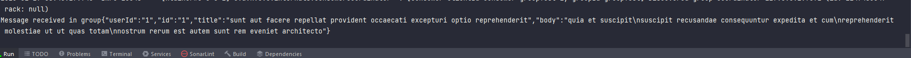

# Poc-Kafka-Producer

# Poc-Java-Sqs-DynamoDB-

Link api utilizada:

https://jsonplaceholder.typicode.com/posts

Faça um clone do projeto atual e deste https://github.com/Ratkovski/Poc-Java-Kafka-Consumer para que ambos se comuniquem:

Esta aplicação tem por finalidade fazer enviar uma mensagem para o tópico.

E a aplicação https://github.com/Ratkovski/Poc-Java-Kafka-Consumer terá como consumir a mensagem enviada para o tópico.

# Caso não tenha o docker

Download -> https://www.docker.com/products/docker-desktop

Configurações adicionais -> https://docs.microsoft.com/en-us/windows/wsl/install-manual

Ficou com dúvidas de como instalar siga o tutorial do youtube: 

https://www.youtube.com/watch?v=oQ08ZaOAiGU&ab_channel=CaravanaCloud

# Analogia de como funciona o Kafka:

[Arquivo drawio](src/docs/kafka%20analogia.drawio)

# Iniciando com as Aplicações 

- Baixe as duas aplicações e de start ambas
- Após isso poderá executar o aquivo docker-run.sh ou executar via comando:

Dentro do projeto onde se encontra o arquivo docker-compose.yml rode o comando do docker para subir as configuraçoes do localstack:
```
docker-compose up 
``` 
Estes dois comandos abaixo servem para forçar a deletar imagens ou containers do docker que possam causar conflito Comando do docker-compose para limpar os containers
```
docker container prune  
```
Comando do docker compose para limpar as imagens
```
docker images prune
```
Após isso basta ir no postman e executar uma requisição GET ou importar a collection
```
http://localhost:9000/posts/1
```
[Collection](src/docs/kafka.postman_collection.json)

Acessando o dashboard do Lenses
```
http://localhost:3030/
```


Clicando no Kafka Topics UI você terá a visualização dos topicos e das mensagens consumidas


Se tudo estiver correto no log da aplicação de consumer você verá o log com a requisição que mandou 
